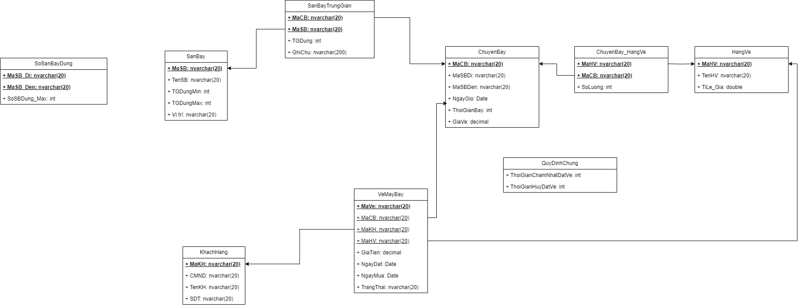
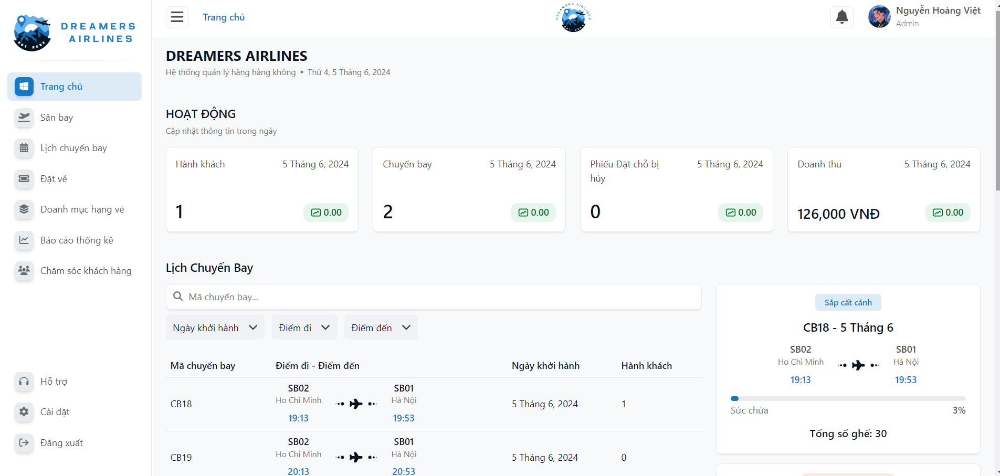
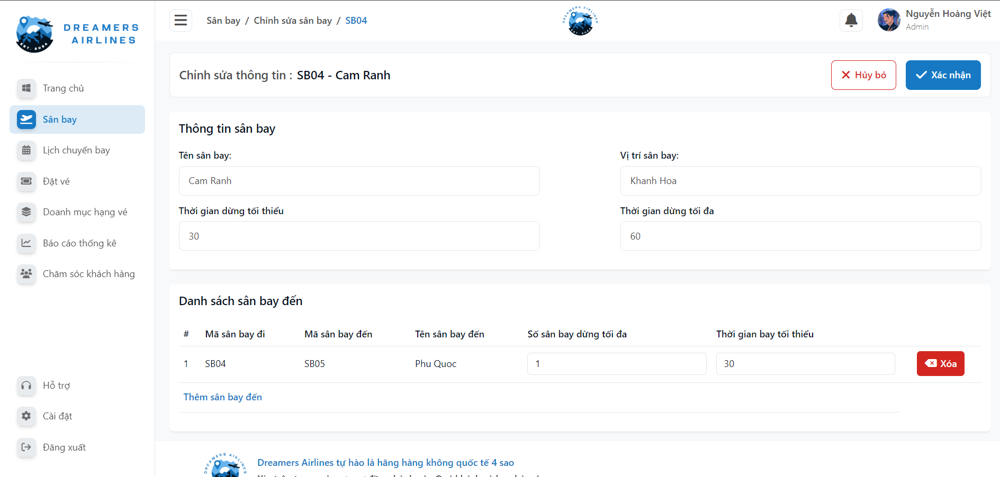
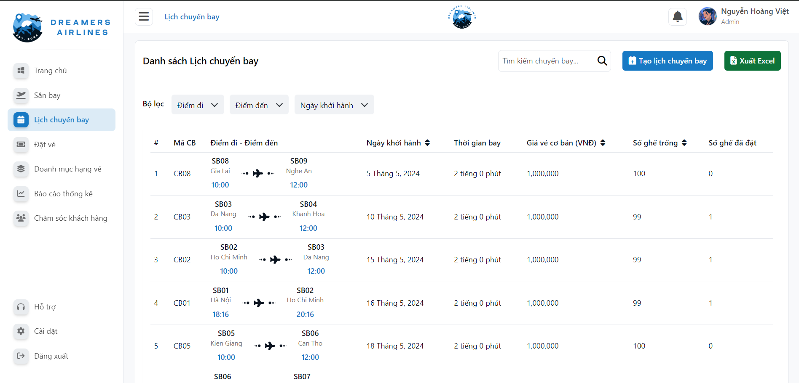
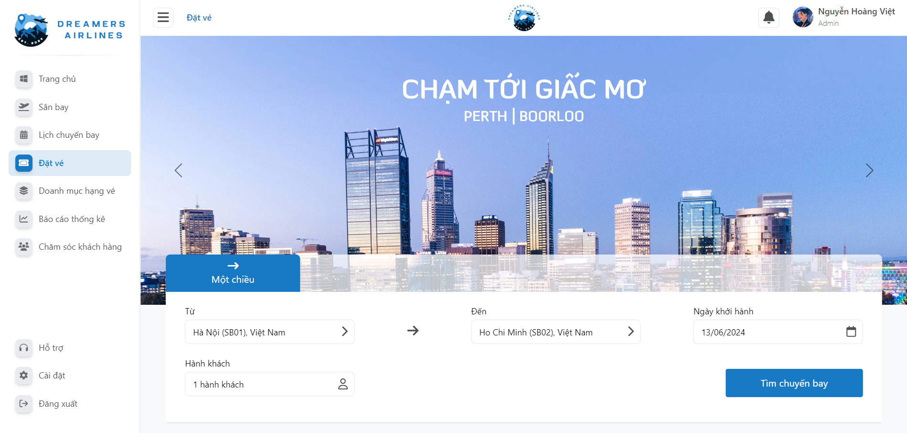
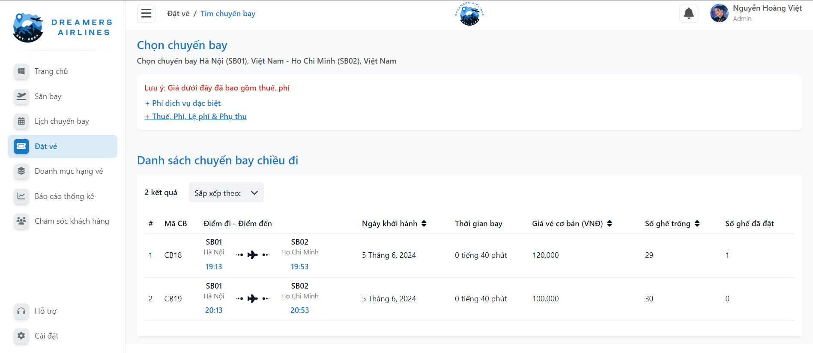
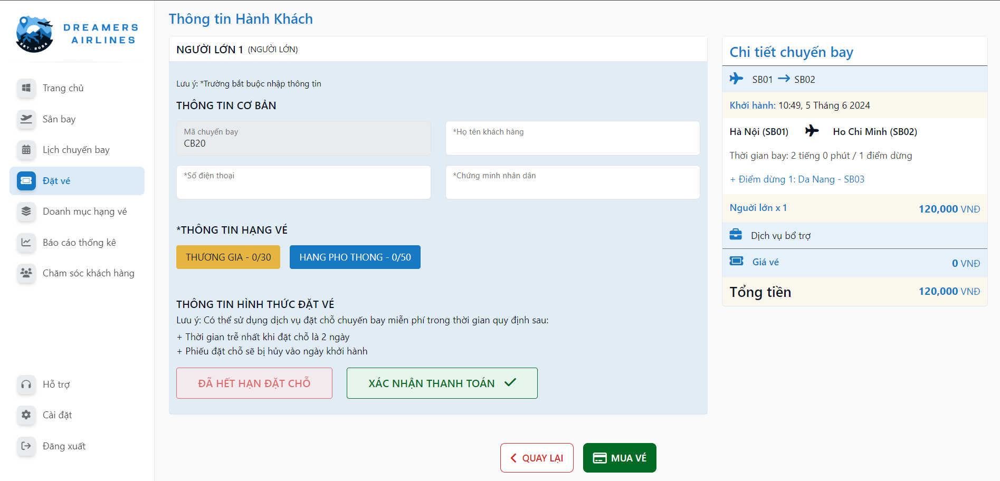
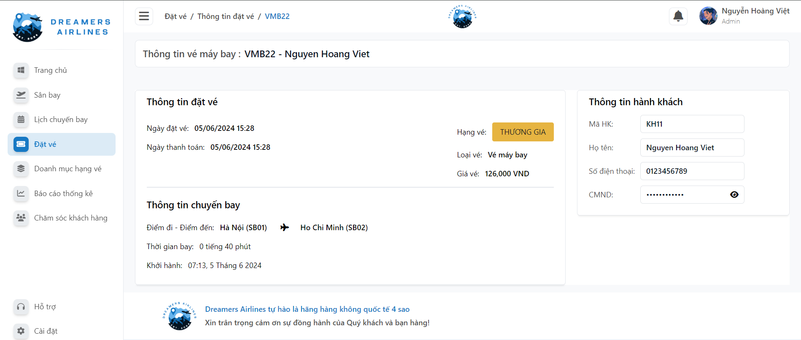

# Web Application Airline Ticket Management 

## Project Introduction
We developed a comprehensive airline ticket management system with a dashboard, CRUD operations for airports, flight schedules, flight search, booking management, tracking, reporting with statistical charts, customer support and manage system policy settings.
* This project is used to serve as a final term project for a course in the Software Engineer department at UIT: Introduction to Software Engineering - SE104 (9.5/10) 

## Team Members

| ID        | Name         | Facebook                          | Contribution %  |
| :-------- | :----------- | :-------------------------------- | :-------------- |
| 21522791  | Nguyễn Hoàng Việt | [Nguyễn Hoàng Việt](https://www.facebook.com/NgyenHoangViet) | 100 |
| 21520400  | Nguyễn Hoàng Phúc | [Nguyễn Hoàng Phúc](https://www.facebook.com/hoangphucseiza) | 100 |
| 21522049  | Nguyễn Thị Bích Hảo | ... | 100 |
| 21521349  | Phạm Nhật Quang | ... | 100 |
| 21521447  | Nguyễn Văn Quốc Thanh | ... | 100 |

## Technologies Used

- **Frontend**: React, Bootstrap
- **Backend**: ASP.Net Web API
- **Database**: MS SQL Server

## Database Schema 

## Main Features of the Website

### Main Features for Admins
> * Dashboard
> * Manage Airports
> * Manage Flight Schedules
> * Manage Flight Search and Booking Ticket
> * Manage and Tracking Tickets
> * Manage Ticket Ranks
> * Reporting with Statistical Charts by Month, Year.
> * Customer Support
> * Manage System Policy Settings.
## Demo of Some Interfaces

>* Dashboard

>* Manage Airports

>* Manage Flight Schedules

>* Flight Search

 

>* Booking Management and Tracking

## Installation Guide

### Prerequisites

### Frontend Setup

   
### Backend Setup
